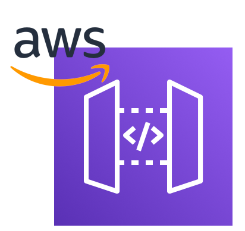

<!-- color: #333 -->
<!-- backgroundColor: #eee -->

# One Auth <br />to rule them all 
## Centralizing Authentication with Azure and API Gateway

<br/>
Filippos Karailanidis

@filkaris


<script type="module">
  import mermaid from 'https://cdn.jsdelivr.net/npm/mermaid@11/dist/mermaid.esm.min.mjs';
  mermaid.initialize({ 
    startOnLoad: true, 
    themeVariables: {fontSize: "16pt"}, 
    sequence: { mirrorActors: false} 
  });
  mermaid.registerIconPacks([
  {
    name: 'logos',
    loader: function a() { return fetch('https://unpkg.com/@iconify-json/logos/icons.json').then(function a(res) { return res.json()}); },
  },
  {
    name: 'clarity',
    loader: function a() { return fetch('https://unpkg.com/@iconify-json/clarity/icons.json').then(function a(res) { return res.json()}); },
  },
]);
</script>

---

# Who are we?


* Leading fintech company
* Specialize in Currency trading
* Offices in Cyprus, Greece, London, Dubai, Japan, USA
* Support 30 languages
* 10+ Million clients worldwide
* 1400+ employees / 600+ IT 

---

# Internal Services Landscape


* Older and newer systems
* Different UIs
* Different Technologies

---


# Let's create a standard!


---
# Set a standard
Spring of 2023 - common standard for internal applications


---
# Set a standard
Spring of 2023 - common standard for internal applications

<li>Appearence</li>

---
# Set a standard
Spring of 2023 - common standard for internal applications

<li>Appearence</li>
<li>Decoupled frontend/backend</li>

---
# Set a standard
Spring of 2023 - common standard for internal applications

<li>Appearence</li>
<li>Decoupled frontend/backend</li>
<li style="text-decoration:underline">Authentication/Authorization</li>

---
# Why do you care?

<div style="display:flex;justify-content:space-between;align-items:end;text-align:center">
    <div>
        <br/>
        AWS API Gateway
    </div>
    <div>
        <br/>
        JWT
    </div>
    <div>
        <br/>
        Azure Active Directory
    </div>
</div>

---
# Why do you care?

<div style="display:flex;justify-content:space-between;align-items:end;text-align:center">
    <div>
        <br/>
        AWS API Gateway
    </div>
    <div>
        <br/>
        JWT
    </div>
    <div>
        <br/>
        Azure Active Directory
    </div>
</div>

<h2 style="text-decoration:underline">Look out for &#128161;</h2>

---
<!-- color: #333 -->
<!-- backgroundColor: #eee -->
# Where we are now

<pre class="mermaid arch">
architecture-beta
    service u(clarity:user-solid)[User]
    service fe(clarity:display-solid)[Frontend]
    service be(clarity:rack-server-line)[Backend]

    u:R --> L:fe
    fe:R --> L:be
</pre>

---
# Where we are now

<pre class="mermaid arch">
architecture-beta
    service u(clarity:user-solid)[User]
    service fe(clarity:display-solid)[Frontend]
    service be(clarity:rack-server-line)[Backend]

    u:R --> L:fe
    fe:R --> L:be
</pre>
<div class="note">
    Auth???
</div>

---
# Quick Reminder, 

---
# Quick Reminder, 
## Authentication vs Authorization

---
# Quick Reminder, 
## Authentication vs Authorization
Authentication = key = Can you enter the house?

---
# Quick Reminder, 
## Authentication vs Authorization
Authentication = key = Can you enter the house?
Authorization = identity = Can you pet the cat?

---


---
# Authentication Flow

<div class="mermaid seq">
  sequenceDiagram
    participant F as Frontend App
    participant A as Azure
</div>

---
# Authentication Flow

<div class="mermaid seq">
  sequenceDiagram
    participant F as Frontend App
    participant A as Azure
    F->>A: Redirect to Login
</div>

---
# Authentication Flow

<div class="mermaid seq">
  sequenceDiagram
    participant F as Frontend App
    participant A as Azure
    F->>A: Redirect to Login
    A->>F: JWT
</div>

---
# Authentication Flow

<div class="mermaid seq">
  sequenceDiagram
    participant F as Frontend App
    participant A as Azure
    F->>A: Redirect to Login
    A->>F: JWT
</div>
<div class="note">
    &#9989; Authentication
</div>

---
# Where we are now

<pre class="mermaid arch">
architecture-beta
    service u(clarity:user-solid)[User]
    service fe(clarity:display-solid)[Frontend]
    service be(clarity:rack-server-line)[Backend]

    u:R --> L:fe
    fe:R --> L:be
</pre>

---
# Where we are now + authentication

<pre class="mermaid arch">
architecture-beta
    service u(clarity:user-solid)[User]
    service fe(clarity:display-solid)[Frontend]
    service be(clarity:rack-server-line)[Backend]
    service az(logos:microsoft-azure)[Azure]

    u:R --> L:fe
    fe:R --> L:be
    fe:B --> T:az
</pre>

---
# Azure


---
# Request Flow

<div class="mermaid seq">
  sequenceDiagram
    participant F as Frontend App
    participant A as Azure
    participant B as Backend App
    F->>B: GET /clients (JWT)
</div>

---
# Request Flow

<div class="mermaid seq">
  sequenceDiagram
    participant F as Frontend App
    participant A as Azure
    participant B as Backend App
    F->>B: GET /clients (JWT)
    Note over B: Check JWT
</div>

---
# Request Flow

<div class="mermaid seq">
  sequenceDiagram
    participant F as Frontend App
    participant A as Azure
    participant B as Backend App
    F->>B: GET /clients (JWT)
    B->>A: Get GROUPS (JWT)
</div>

---
# Request Flow

<div class="mermaid seq">
  sequenceDiagram
    participant F as Frontend App
    participant A as Azure
    participant B as Backend App
    F->>B: GET /clients (JWT)
    B->>A: Get AD GROUPS (JWT)
    A->>B: AD GROUPS
</div>

---
# Request Flow

<div class="mermaid seq">
  sequenceDiagram
    participant F as Frontend App
    participant A as Azure
    participant B as Backend App
    F->>B: GET /clients (JWT)
    B->>A: Get AD GROUPS (JWT)
    A->>B: AD GROUPS
    Note over B: Has GROUP_1 ?
</div>

---
# Request Flow

<div class="mermaid seq">
  sequenceDiagram
    participant F as Frontend App
    participant A as Azure
    participant B as Backend App
    F->>B: GET /clients (JWT)
    B->>A: Get AD GROUPS (JWT)
    A->>B: AD GROUPS
    Note over B: Has GROUP_1 ?
</div>
<div class="note">
&#9989; Authorization
</div>

---
# Request Flow

<div class="mermaid seq">
  sequenceDiagram
    participant F as Frontend App
    participant A as Azure
    participant B as Backend App
    F->>B: GET /clients (JWT)
    B->>A: Get AD GROUPS (JWT)
    A->>B: AD GROUPS
    Note over B: Has GROUP_1 ?
    B->>F: List of clients
</div>

---
# Where we are now + authentication

<pre class="mermaid arch">
architecture-beta
    service u(clarity:user-solid)[User]
    service fe(clarity:display-solid)[Frontend]
    service be(clarity:rack-server-line)[Backend]
    service az(logos:microsoft-azure)[Azure]

    u:R --> L:fe
    fe:R --> L:be
    fe:B --> T:az
</pre>

---
# Where we are now + authorization

<pre class="mermaid arch">
architecture-beta
    service u(clarity:user-solid)[User]
    service fe(clarity:display-solid)[Frontend]
    service be(clarity:rack-server-line)[Backend]
    service az(logos:microsoft-azure)[Azure]

    u:R --> L:fe
    fe:R --> L:be
    fe:B --> T:az
    be:B --> R:az
</pre>

---
# Where we are now + authorization

<pre class="mermaid arch">
architecture-beta
    service u(clarity:user-solid)[User]
    service fe(clarity:display-solid)[Frontend]
    service be(clarity:rack-server-line)[Backend]
    service az(logos:microsoft-azure)[Azure]

    u:R --> L:fe
    fe:R --> L:be
    fe:B --> T:az
    be:B --> R:az
</pre>
<div class="note">
Performance...
</div>

---
# Caching

<div class="mermaid seq">
  sequenceDiagram
    participant F as Frontend App
    participant B as Backend App
    F->>B: GET /clients (JWT)
</div>

---
# Caching

<div class="mermaid seq">
  sequenceDiagram
    participant F as Frontend App
    participant B as Backend App
    participant R as Redis
    F->>B: GET /clients (JWT)
</div>

---
# Caching

<div class="mermaid seq">
  sequenceDiagram
    participant F as Frontend App
    participant B as Backend App
    participant R as Redis
    F->>B: GET /clients (JWT)
    B->>R: Check JWT
</div>

---
# Caching

<div class="mermaid seq">
  sequenceDiagram
    participant F as Frontend App
    participant B as Backend App
    participant R as Redis
    participant A as Azure
    F->>B: GET /clients (JWT)
    B->>R: Check JWT
    rect rgb(255, 185, 185)
    B->>A: Get AD GROUPS (JWT)
    end
</div>

---
# Caching

<div class="mermaid seq">
  sequenceDiagram
    participant F as Frontend App
    participant B as Backend App
    participant R as Redis
    participant A as Azure
    F->>B: GET /clients (JWT)
    B->>R: Check JWT
    rect rgb(255, 185, 185)
    B->>A: Get AD GROUPS (JWT)
    A->>B: AD GROUPS
    end
</div>

---
# Caching

<div class="mermaid seq">
  sequenceDiagram
    participant F as Frontend App
    participant B as Backend App
    participant R as Redis
    participant A as Azure
    F->>B: GET /clients (JWT)
    B->>R: Check JWT
    rect rgb(255, 185, 185)
    B->>A: Get AD GROUPS (JWT)
    A->>B: AD GROUPS
    B->>R: Set Groups
    end
</div>

---
# Caching

<div class="mermaid seq">
  sequenceDiagram
    participant F as Frontend App
    participant B as Backend App
    participant R as Redis
    F->>B: GET /clients (JWT)
</div>

---
# Caching

<div class="mermaid seq">
  sequenceDiagram
    participant F as Frontend App
    participant B as Backend App
    participant R as Redis
    F->>B: GET /clients (JWT)
    B->>R: Check JWT
</div>

---
# Caching

<div class="mermaid seq">
  sequenceDiagram
    participant F as Frontend App
    participant B as Backend App
    participant R as Redis
    F->>B: GET /clients (JWT)
    B->>R: Check JWT
    rect rgb(185, 255, 185)
    R->>B: Get Groups (Hit)
    end
</div>

---
# Where we are now + authorization

<pre class="mermaid arch">
architecture-beta
    service u(clarity:user-solid)[User]
    service fe(clarity:display-solid)[Frontend]
    service be(clarity:rack-server-line)[Backend]
    service az(logos:microsoft-azure)[Azure]

    u:R --> L:fe
    fe:R --> L:be
    fe:B --> T:az
    be:B --> R:az
</pre>

---
# Where we are now + caching

<pre class="mermaid arch">
architecture-beta
    service u(clarity:user-solid)[User]
    service fe(clarity:display-solid)[Frontend]
    service be(clarity:rack-server-line)[Backend]
    service az(logos:microsoft-azure)[Azure]
    service red(logos:redis)[Redis]

    u:R --> L:fe
    fe:R --> L:be
    fe:B --> T:az
    be:B --> T:az
    be:B --> T:red
</pre>

---
<!-- color: #333 -->
<!-- backgroundColor: #eefaff -->
# Where we want to be

<pre class="mermaid arch">
architecture-beta
    group mid(clarity:settings-line)[Middleware]

    service u(clarity:user-solid)[User]
    service fe(clarity:display-solid)[Frontend]
    service be(clarity:rack-server-line)[Backend]
    service az(logos:microsoft-azure)[Azure]
    service m(hi)[Gateway] in mid
    service red(logos:redis)[Redis] in mid

    u:R --> L:fe
    fe:R --> L:m
    fe:B --> T:az
    m:B --> T:az
    m:B --> T:red
    m:R --> L:be
</pre>

---


---


---


---
# Gateway Implementation

---
# Gateway Implementation
## AWS API Gateway

---
# Gateway Implementation
## AWS API Gateway

Single "access point"
Can talk to multiple Backends

---
# Gateway Implementation
## AWS API Gateway

Single "access point"
Can talk to multiple Backends

## + Lambda Authorizer

---
# Gateway Implementation
## AWS API Gateway

Single "access point"
Can talk to multiple Backends

## + Lambda Authorizer

Checks the JWT

---


---
# Gateway Implementation

Lambda returns a policy

---
# Gateway Implementation

Lambda returns a policy

```json
{
    "Version": "2012-10-17",
    "Statement": [
        {
            "Action": ["execute-api:Invoke"],
            "Effect": "Allow",
            "Resource": ["user"]
        } 
    ]
}
```

---

# Gateway Implementation

Lambda returns a policy

```json
{
    "Version": "2012-10-17",
    "Statement": [
        {
            "Action": ["execute-api:Invoke"],
            "Effect": "Allow",
            "Resource": ["user"]
        } 
    ]
}
```

What about `GROUP_1, GROUP_2` as HTTP headers?

---
# &#128161; Gateway Implementation - Context

---
# &#128161; Gateway Implementation - Context

```go
// lambda.go

authResponse := events.APIGatewayCustomAuthorizerResponse{PrincipalID: principalID}

authResponse.PolicyDocument = ...
authResponse.Context = map[string]interface{}{
    "groups": "GROUP_1,GROUP_2",
}

return authResponse
```

---
# &#128161; Gateway Implementation - Context

```go
// lambda.go

authResponse := events.APIGatewayCustomAuthorizerResponse{PrincipalID: principalID}

authResponse.PolicyDocument = ...
authResponse.Context = map[string]interface{}{
    "groups": "GROUP_1,GROUP_2",
}

return authResponse
```

```yaml
# api-gateway-definition.yaml

x-amazon-apigateway-any-method:
    ...
    requestParameters:
      integration.request.header.X-Groups: "context.authorizer.groups"
```

---
# Request flow - Gateway

<div class="mermaid seq">
  sequenceDiagram
    participant F as Frontend App
    participant G as API GW
    participant L as Lambda Authorizer
    participant B as Backend App
    F->>G: GET /clients (JWT)
</div>

---
# Request flow - Gateway

<div class="mermaid seq">
  sequenceDiagram
    participant F as Frontend App
    participant G as API GW
    participant L as Lambda Authorizer
    participant B as Backend App
    F->>G: GET /clients (JWT)
    G->>L: Check Access
</div>

---
# Request flow - Gateway

<div class="mermaid seq">
  sequenceDiagram
    participant F as Frontend App
    participant G as API GW
    participant L as Lambda Authorizer
    participant B as Backend App
    F->>G: GET /clients (JWT)
    G->>L: Check Access
    Note over L: Check JWT (Azure/Redis)
</div>

---
# Request flow - Gateway

<div class="mermaid seq">
  sequenceDiagram
    participant F as Frontend App
    participant G as API GW
    participant L as Lambda Authorizer
    participant B as Backend App
    F->>G: GET /clients (JWT)
    G->>L: Check Access
    Note over L: Check JWT (Azure/Redis)
    L->>G: Policy, Context
</div>

---
# Request flow - Gateway

<div class="mermaid seq">
  sequenceDiagram
    participant F as Frontend App
    participant G as API GW
    participant L as Lambda Authorizer
    participant B as Backend App
    F->>G: GET /clients (JWT)
    G->>L: Check Access
    Note over L: Check JWT (Azure/Redis)
    L->>G: Policy, Context
    G->>B: Get /clients<br/>X-Groups: GROUP_1,GROUP_2
</div>

---
# Where we want to be

<pre class="mermaid arch">
architecture-beta
    group mid(clarity:settings-line)[Middleware]

    service u(clarity:user-solid)[User]
    service fe(clarity:display-solid)[Frontend]
    service be(clarity:rack-server-line)[Backend]
    service az(logos:microsoft-azure)[Azure]
    service m(hi)[Gateway] in mid
    service red(logos:redis)[Redis] in mid

    u:R --> L:fe
    fe:R --> L:m
    fe:B --> T:az
    m:B --> T:az
    m:B --> T:red
    m:R --> L:be
</pre>

---
# Where we want to be + gateway

<pre class="mermaid arch">
architecture-beta
    group mid(clarity:settings-line)[Middleware]

    service u(clarity:user-solid)[User]
    service fe(clarity:display-solid)[Frontend]
    service be(clarity:rack-server-line)[Backend]
    service az(logos:microsoft-azure)[Azure]
    service m(logos:aws-api-gateway)[AWS API Gateway] in mid
    service red(logos:redis)[Redis] in mid

    u:R --> L:fe
    fe:R --> L:m
    fe:B --> T:az
    m:B --> T:az
    m:B --> T:red
    m:R --> L:be
</pre>

---
# Where we want to be + gateway

<pre class="mermaid arch-small">
architecture-beta
    group mid(clarity:settings-line)[Middleware]

    service u(clarity:user-solid)[User]
    service fe(clarity:display-solid)[Frontend]
    service be(clarity:rack-server-line)[Backend]
    service az(logos:microsoft-azure)[Azure]
    service gw(logos:aws-api-gateway)[AWS API GW] in mid
    service l(logos:aws-lambda)[AWS Lambda Authorizer] in mid
    service red(logos:redis)[Redis] in mid

    u:R --> L:fe
    fe:R --> L:gw
    fe:B --> T:az
    gw:R --> L:be
    gw:B --> T:l
    l:L --> R:az
    l:B --> T:red
</pre>

---
# Where we want to be + gateway

<pre class="mermaid arch-small">
architecture-beta
    group mid(clarity:settings-line)[Middleware]

    service u(clarity:user-solid)[User]
    service fe(clarity:display-solid)[Frontend]
    service be(clarity:rack-server-line)[Backend]
    service az(logos:microsoft-azure)[Azure]
    service gw(logos:aws-api-gateway)[AWS API GW] in mid
    service l(logos:aws-lambda)[AWS Lambda Authorizer] in mid
    service red(logos:redis)[Redis] in mid

    u:R --> L:fe
    fe:R --> L:gw
    fe:B --> T:az
    gw:R --> L:be
    gw:B --> T:l
    l:L --> R:az
    l:B --> T:red
</pre>
<div class="note">
Improve
</div>

---
<!-- backgroundColor: #eeffee -->


---


---
# JWT 

Plain Authentication

```json
{
  "aud": "00000003-0000-0000-c000-000000000000",
  "iss": "https://sts.windows.net/********-****-****-****-************/",
  "exp": 1727256721,
  "appid": "********-****-****-****-************",
  "family_name": "Karailanidis",
  "given_name": "Filippos",
  "scp": "profile User.Read email",
  ...
}
```

---
# JWT 

* Do we need to call Azure to get user groups?
* NO!
* With the magic of: **Claims**

---
# JWT Claims
```json
{
  "aud": "00000003-0000-0000-c000-000000000000",
  "iss": "https://sts.windows.net/********-****-****-****-************/",
  "exp": 1727256721,
  "appid": "********-****-****-****-************",
  "family_name": "Karailanidis",
  "given_name": "Filippos",
  "scp": "profile User.Read email",
  ...
  "claim1": "foo",
  "claim2": "bar",
  "claim3": "baz",
  ...
}
```

---
# JWT Claims


---
# JWT Claims

```json
{
  "aud": "00000003-0000-0000-c000-000000000000",
  "iss": "https://sts.windows.net/********-****-****-****-************/",
  "exp": 1727256721,
  "appid": "********-****-****-****-************",
  "family_name": "Karailanidis",
  "given_name": "Filippos",
  "scp": "profile User.Read email",
  ...
  "groups" : ["GROUP_1", "GROUP_2"],
  ...
}
```

---
# JWT Claims - Win!

* No need to query Graph API + cache groups
* Frontend has information about groups
* JWT signing prevents tampering

---
# JWT Claims

BUT...

---
# JWT Validation &#129318;


---
# JWT Validation - Step back

---
# JWT Validation - Step back

<div class="mermaid seq">
  sequenceDiagram
    actor U as User
    participant F as Frontend App
    participant A as Azure
    U->>F: Open Webpage
    F->>A: Redirect to Login
    A->>F: JWT
</div>

---
# JWT Validation - Step back

<div class="mermaid seq">
  sequenceDiagram
    actor U as User
    participant F as Frontend App
    participant A as Azure
    U->>F: Open Webpage
    Note over F, A: scope: <br/>profile User.Read email
    F->>A: Redirect to Login
    A->>F: JWT
</div>

---
# JWT Validation - Step back

<div class="mermaid seq">
  sequenceDiagram
    actor U as User
    participant F as Frontend App
    participant A as Azure
    U->>F: Open Webpage
    Note over F, A: scope: <br/>profile User.Read email 
    F->>A: Redirect to Login
    Note over F, A: accessToken: ...<br/>  idToken: ...<br/>  refreshToken: ...
    A->>F: JWT
</div>

---
# JWT Validation

Tokens:

- Access Token
- Id Token
- Refresh Token

---
# JWT Validation

## Refresh Token
- Part of OAuth 2.0
- Can be JWT
- Used to get fresh access tokens

---
# JWT Validation

<div class="columns">
    <div>
        <h2>Access Token</h2>
        <ul>
            <li>Part of OAuth 2.0</li>
            <li>Can be JWT</li>
            <li>Used as bearer for API Calls</li>
            <li>Contains claims that are utilized by the Backend</li>
        </ul>
    </div>
</div>

---
# JWT Validation

<div class="columns">
    <div>
        <h2>Access Token</h2>
        <ul>
            <li>Part of OAuth 2.0</li>
            <li>Can be JWT</li>
            <li>Used as bearer for API Calls</li>
            <li>Contains claims that are utilized by the Backend</li>
        </ul>
    </div>
    <div>
        <h2>Id Token</h2>
        <ul>
            <li>Part of OpenID Connect</li>
            <li>Must be JWT</li>
            <li>Validated and decrypted by the Frontend</li>
            <li>Contains claims that are utilized by the Frontend</li>
        </ul>
    </div>
</div>

---
# JWT Validation

Validate using public key (JWKS) from Microsoft

https://login.microsoftonline.com/common/discovery/keys

---
# JWT Validation

## Access Token
- &#10060; Validate


## Id Token
- &#9989; Validate

---
# Access Token vs ID Token

Just use ID Token?

---
# Access Token vs ID Token

Just use ID Token?

Well... you probably shouldn't

---
# Access Token vs ID Token
ID Token is for __client use only__

---
# Access Token vs ID Token
ID Token is for __client use only__

Access Token is meant for Bearer
* It contains scope
* It is short lived
* It can be refreshed
 
---
# Access Token vs ID Token

But we cannot validate it!

How can we make it work?

---
# Scope

Notice the requested "scope:"

---
# Scope

Notice the requested "scope:"

<div class="mermaid seq">
  sequenceDiagram
    actor U as User
    participant F as Frontend App
    participant A as Azure
    U->>F: Open Webpage
    Note over F, A: scope: <br/>profile User.Read email
    F->>A: Redirect to Login
    A->>F: JWT
</div>

---
# Scope

Using any Graph scopes, creates an Access Token meant to be parsed by Graph

---
# Scope

Using any Graph scopes, creates an Access Token meant to be parsed by Graph

<pre>
{
  <mark>"aud": "00000003-0000-0000-c000-000000000000",</mark>
  "iss": "https://sts.windows.net/********-****-****-****-************/",
  "exp": 1727256721,
  "appid": "********-****-****-****-************",
  "family_name": "Karailanidis",
  "given_name": "Filippos",
  "scp": "profile User.Read email",
  "groups" : ["GROUP_1", "GROUP_2"],
  ...
}
</pre>

---
# Scope

Using any Graph scopes, creates an Access Token meant to be parsed by Graph

<pre>
{
  <mark>"aud": "00000003-0000-0000-c000-000000000000",</mark>
  "iss": "https://sts.windows.net/********-****-****-****-************/",
  "exp": 1727256721,
  "appid": "********-****-****-****-************",
  "family_name": "Karailanidis",
  "given_name": "Filippos",
  "scp": "profile User.Read email",
  "groups" : ["GROUP_1", "GROUP_2"],
  ...
}
</pre>

We need to tell Azure, we have our own "custom" API

---
# Scope

Home > App Registrations > Expose An API > Add a scope


---
# &#128161; Scope

In the Frontend request

```json
    scope: "api://********-****-****-****-************/<endpoint>"
```

---
# &#128161; Scope

In the Frontend request

```json
    scope: "api://********-****-****-****-************/<endpoint>"
```

## Access Token
```json
{
  "aud": "api://********-****-****-****-************",
  "scp": "<endpoint>",
  ...
}
```

---
# &#128161; Scope

In the Frontend request

```json
    scope: "api://********-****-****-****-************/<endpoint>"
```

## Access Token
```json
{
  "aud": "api://********-****-****-****-************",
  "scp": "<endpoint>",
  ...
}
```
&#9989; Validate

---
# Request flow - Access Token

<div class="mermaid seq">
  sequenceDiagram
    participant F as Frontend App
    participant G as API GW
    participant L as Lambda Authorizer
    F->>G: GET /clients
</div>

---
# Request flow - Access Token

<div class="mermaid seq">
  sequenceDiagram
    participant F as Frontend App
    participant G as API GW
    participant L as Lambda Authorizer
    F->>G: GET /clients<br/>Bearer: Access Token
</div>

---
# Request flow - Access Token

<div class="mermaid seq">
  sequenceDiagram
    participant F as Frontend App
    participant G as API GW
    participant L as Lambda Authorizer
    F->>G: GET /clients<br/>Bearer: Access Token
    G->>L: Check Access
</div>

---
# Request flow - Access Token

<div class="mermaid seq">
  sequenceDiagram
    participant F as Frontend App
    participant G as API GW
    participant L as Lambda Authorizer
    F->>G: GET /clients<br/>Bearer: Access Token
    G->>L: Check Access
    Note over L: Validate JWT
</div>

---
# Request flow - Access Token

<div class="mermaid seq">
  sequenceDiagram
    participant F as Frontend App
    participant G as API GW
    participant L as Lambda Authorizer
    participant A as Azure
    F->>G: GET /clients<br/>Bearer: Access Token
    G->>L: Check Access
    Note over L: Validate JWT
</div>

---
# Request flow - Access Token

<div class="mermaid seq">
  sequenceDiagram
    participant F as Frontend App
    participant G as API GW
    participant L as Lambda Authorizer
    participant A as Azure
    F->>G: GET /clients<br/>Bearer: Access Token
    G->>L: Check Access
    L->>A: Get JWKS (once)
    Note over L: Validate JWT
</div>

---
# Request flow - Access Token

<div class="mermaid seq">
  sequenceDiagram
    participant F as Frontend App
    participant G as API GW
    participant L as Lambda Authorizer
    participant A as Azure
    F->>G: GET /clients<br/>Bearer: Access Token
    G->>L: Check Access
    L->>A: Get JWKS (once)
    Note over L: Validate JWT
    Note over L: Decode Claims
</div>

---
# Request flow - Access Token

<div class="mermaid seq">
  sequenceDiagram
    participant F as Frontend App
    participant G as API GW
    participant L as Lambda Authorizer
    participant A as Azure
    F->>G: GET /clients<br/>Bearer: Access Token
    G->>L: Check Access
    L->>A: Get JWKS (once)
    Note over L: Validate JWT
    Note over L: Decode Claims
    L->>G: Policy, Context
</div>

---
# Where we want to be + gateway

<pre class="mermaid arch-small">
architecture-beta
    group mid(clarity:settings-line)[Middleware]

    service u(clarity:user-solid)[User]
    service fe(clarity:display-solid)[Frontend]
    service be(clarity:rack-server-line)[Backend]
    service az(logos:microsoft-azure)[Azure]
    service gw(logos:aws-api-gateway)[AWS API GW] in mid
    service l(logos:aws-lambda)[AWS Lambda Authorizer] in mid
    service red(logos:redis)[Redis] in mid

    u:R --> L:fe
    fe:R --> L:gw
    fe:B --> T:az
    gw:R --> L:be
    gw:B --> T:l
    l:L --> R:az
    l:B --> T:red
</pre>

---
# Where we want to be + JWT claims

<pre class="mermaid arch-small">
architecture-beta
    group mid(clarity:settings-line)[Middleware]

    service u(clarity:user-solid)[User]
    service fe(clarity:display-solid)[Frontend]
    service be(clarity:rack-server-line)[Backend]
    service az(logos:microsoft-azure)[Azure]
    service gw(logos:aws-api-gateway)[AWS API GW] in mid
    service l(logos:aws-lambda)[AWS Lambda Authorizer] in mid

    u:R --> L:fe
    fe:R --> L:gw
    fe:B --> T:az
    gw:R --> L:be
    gw:B --> T:l
    l:L --> R:az
</pre>

---
<!-- backgroundColor: #fffaee -->


---


---
# Groups

End goal?

<div class="columns">
    <div>
        <h2>Input</h2>
        <code>fkarailanidis</code>
    </div>
    <div>
        <h2>Output</h2>
        <code>CRM_VIEW_CLIENT</code>, <code>CRM_EDIT_CLIENT</code>
    </div>
</div>

---
# Our Structure

<div class="mermaid" style="font-size: 20pt">
  flowchart LR
    subgraph AD[Azure AD]
        u["(user) fkarailanidis"]
    end
</div>

---
# Our Structure

<div class="mermaid">
  flowchart LR
    subgraph AD[Azure AD]
        u1["(user) fkarailanidis"]
        u2["(user) gpapadopoulos"]
        u3["(user) kpetropoulos"]
    end
</div>

---
# Our Structure

<div class="mermaid">
  flowchart LR
    subgraph AD[Azure AD]
        subgraph G["(group) GROUP_1"]
            u1["(user) fkarailanidis"]
            u2["(user) gpapadopoulos"]
            u3["(user) kpetropoulos"]
        end
    end
    style G fill:#eefffa
</div>

---
# Our Structure

<div class="mermaid">
  flowchart LR
    subgraph AD[Azure AD]
        subgraph G["(group) SALES"]
            u1["(user) fkarailanidis"]
            u2["(user) gpapadopoulos"]
            u3["(user) kpetropoulos"]
        end
    end
    style G fill:#eefffa
</div>

---
# Our Structure

<div class="mermaid">
  flowchart LR
    subgraph AD[Azure AD]
        subgraph G["(group) ROLE_SALES"]
            u1["(user) fkarailanidis"]
            u2["(user) gpapadopoulos"]
            u3["(user) kpetropoulos"]
        end
    end
    style G fill:#eefffa
</div>

---
# Our Structure

<div class="mermaid">
  flowchart LR
    subgraph AD[Azure AD]
        subgraph G2["(group) ROLE_COMPLIANCE"]
            u4["(user) ppetridou"]
            u5["(user) epapadakis"]
        end
        subgraph G1["(group) ROLE_SALES"]
            u1["(user) fkarailanidis"]
            u2["(user) gpapadopoulos"]
            u3["(user) kpetropoulos"]
        end
    end
    style G1 fill:#eefffa
    style G2 fill:#eefffa
</div>

---
# Our Structure

<div class="mermaid">
  flowchart LR
    subgraph AD[Azure AD]
        subgraph G3["(group) ROLE_SUPPORT"]
            u7["(user) apappa"]
            u8["(user) pmarkou"]
            u9["(user) rnikolaou"]
        end
        subgraph G2["(group) ROLE_COMPLIANCE"]
            u4["(user) ppetridou"]
            u5["(user) epapadakis"]
        end
        subgraph G1["(group) ROLE_SALES"]
            u1["(user) fkarailanidis"]
            u2["(user) gpapadopoulos"]
            u3["(user) kpetropoulos"]
        end
    end
    style G1 fill:#eefffa
    style G2 fill:#eefffa
    style G3 fill:#eefffa
</div>

---
# System Permissions

<div class="mermaid" style="position:relative; top:137px;">
  flowchart LR
    x[(CRM)]

</div>

---
# System Permissions

<div class="mermaid">
  flowchart RL
    VIEW_CLIENT --> x[(CRM)]
    EDIT_CLIENT --> x[(CRM)]
    DELETE_CLIENT --> x[(CRM)]

</div>

---
# Permissions in AD

<div class="mermaid">
  flowchart LR
    subgraph AD[Azure AD]
        subgraph G1["(group) DELETE_CLIENT"]
        end
        subgraph G2["(group) EDIT_CLIENT"]
        end
        subgraph G3["(group) VIEW_CLIENT"]
        end
    end
    style G1 fill:#eefffa
    style G2 fill:#eefffa
    style G3 fill:#eefffa
</div>

---
# Permissions in AD

<div class="mermaid">
  flowchart LR
    subgraph AD[Azure AD]
        subgraph G1["(group) CRM_DELETE_CLIENT"]
        end
        subgraph G2["(group) CRM_EDIT_CLIENT"]
        end
        subgraph G3["(group) CRM_VIEW_CLIENT"]
        end
    end
    style G1 fill:#eefffa
    style G2 fill:#eefffa
    style G3 fill:#eefffa
</div>

---
# Permissions in AD

<div class="mermaid">
  flowchart LR
    subgraph AD[Azure AD]
        subgraph G1["(group) CRM_DELETE_CLIENT"]
            u1["(group) ROLE_COMPLIANCE"]:::innerGroup
        end
        subgraph G2["(group) CRM_EDIT_CLIENT"]
            u2["(group) ROLE_COMPLIANCE"]:::innerGroup
            u3["(group) ROLE_SALES"]:::innerGroup
        end
        subgraph G3["(group) CRM_VIEW_CLIENT"]
            u7["(group) ROLE_COMPLIANCE"]:::innerGroup
            u8["(group) ROLE_SALES"]:::innerGroup
            u9["(group) ROLE_SUPPORT"]:::innerGroup
        end
    end
    style G1 fill:#f7ffee
    style G2 fill:#f7ffee
    style G3 fill:#f7ffee
    classDef innerGroup fill:#eefffa, stroke:#aaaa33
</div>

---
# User Permissions

<div class="columns">
    <div>
        <h2>Input</h2>
        <code>fkarailanidis</code>
    </div>
    <div>
        <h2>Output (direct groups)</h2>
        <code>ROLE_SALES</code>
    </div>
</div>

---
# User Permissions

<div class="columns">
    <div>
        <h2>Input</h2>
        <code>fkarailanidis</code>
    </div>
    <div>
        <h2>Output (direct groups)</h2>
        <code>ROLE_SALES</code>
    </div>
    <div>
        <h2>Input</h2>
        <code>fkarailanidis</code>
    </div>
    <div>
        <h2>Output (direct & nested groups)</h2>
        <code>ROLE_SALES</code>, <code>CRM_VIEW_CLIENT</code>, <code>CRM_EDIT_CLIENT</code>
    </div>
</div>

---
# The Problem &#129318;

---
# The Problem &#129318;

Access Token Group Claims - Direct assignment only

---
# The Problem &#129318;

Access Token Group Claims - Direct assignment only
```json
{
  "family_name": "Karailanidis",
  "given_name": "Filippos",
  "groups" : ["ROLE_SALES"],
  ...
}
```

---
# The Problem &#129318;

Access Token Group Claims - Direct assignment only
```json
{
  "family_name": "Karailanidis",
  "given_name": "Filippos",
  "groups" : ["ROLE_SALES"],
  ...
}
```


https://learn.microsoft.com/en-us/entra/identity/enterprise-apps/assign-user-or-group-access-portal

---
# The Solution

---
# The Solution


---
# App Roles

<div class="mermaid">
  flowchart LR
    subgraph AD[Azure AD]
        subgraph G1["(group) CRM_DELETE_CLIENT"]
            u1["(group) ROLE_COMPLIANCE"]:::innerGroup
        end
        subgraph G2["(group) CRM_EDIT_CLIENT"]
            u2["(group) ROLE_COMPLIANCE"]:::innerGroup
            u3["(group) ROLE_SALES"]:::innerGroup
        end
        subgraph G3["(group) CRM_VIEW_CLIENT"]
            u7["(group) ROLE_COMPLIANCE"]:::innerGroup
            u8["(group) ROLE_SALES"]:::innerGroup
            u9["(group) ROLE_SUPPORT"]:::innerGroup
        end
    end
    style G1 fill:#f7ffee
    style G2 fill:#f7ffee
    style G3 fill:#f7ffee
    classDef innerGroup fill:#eefffa, stroke:#aaaa33
</div>

---
# App Roles

<div class="mermaid" style="transform:scale(0.9)">
  flowchart TB
    subgraph AD[Azure AD]
        u7["(group) ROLE_COMPLIANCE"]:::innerGroup
        u8["(group) ROLE_SALES"]:::innerGroup
        u9["(group) ROLE_SUPPORT"]:::innerGroup
        a["(app) CRM"]
    end
    classDef innerGroup fill:#eefffa, stroke:#aaaa33
</div>

---
# App Roles

<div class="mermaid" style="transform:scale(0.9)">
  flowchart TB
    subgraph AD[Azure AD]
        u7["(group) ROLE_COMPLIANCE"]:::innerGroup
        u8["(group) ROLE_SALES"]:::innerGroup
        u9["(group) ROLE_SUPPORT"]:::innerGroup
        a["(app) CRM"]
        u7 -- (app role) CRM_VIEW_CLIENT --> a
        u7 -- (app role) CRM_EDIT_CLIENT --> a
        u7 -- (app role) CRM_DELETE_CLIENT --> a
        u8 -- (app role) CRM_VIEW_CLIENT --> a
        u8 -- (app role) CRM_EDIT_CLIENT --> a
        u9 -- (app role) CRM_VIEW_CLIENT --> a
    end
    classDef innerGroup fill:#eefffa, stroke:#aaaa33
    linkStyle default background-color:#fff0
</div>

---
# App Roles - Environment Separation

<div class="mermaid">
  flowchart TB
    subgraph AD[Azure AD]
        u7["(group) ROLE_COMPLIANCE"]:::innerGroup
        u8["(group) ROLE_DEVELOPMENT"]:::innerGroup
        a1["(app) CRM - Production"]
        a4["(app) CRM - Dev/Test/Staging"]
        u7 -- (app role) CRM_VIEW_CLIENT --> a1
        u7 -- (app role) CRM_EDIT_CLIENT --> a1
        u7 -- (app role) CRM_DELETE_CLIENT --> a1
        u8 -- (app role) CRM_VIEW_CLIENT --> a4
        u8 -- (app role) CRM_EDIT_CLIENT --> a4
        u8 -- (app role) CRM_DELETE_CLIENT --> a4
    end
    classDef innerGroup fill:#eefffa, stroke:#aaaa33
    linkStyle default background-color:#fff0
</div>

---
# App Roles - Environment Separation

<div class="mermaid">
  flowchart TB
    subgraph AD[Azure AD]
        u7["(group) ROLE_COMPLIANCE"]:::innerGroup
        u8["(group) ROLE_DEVELOPMENT"]:::innerGroup
        a1["(app) CRM - Production"]
        a4["(app) CRM - Dev/Test/Staging"]
        u7 -- (app role) VIEW_CLIENT --> a1
        u7 -- (app role) EDIT_CLIENT --> a1
        u7 -- (app role) DELETE_CLIENT --> a1
        u8 -- (app role) VIEW_CLIENT --> a4
        u8 -- (app role) EDIT_CLIENT --> a4
        u8 -- (app role) DELETE_CLIENT --> a4
    end
    classDef innerGroup fill:#eefffa, stroke:#aaaa33
    linkStyle default background-color:#fff0
</div>

---
# App Roles - Create

Azure Portal > App Registration > App Roles > Create app role


---
# App Roles - Assign

Azure Portal > Enterprise Applications > Users and groups > Add user/group


---
# &#128161; App Roles

Access Token Claims
<pre>
{
  "family_name": "Karailanidis",
  "given_name": "Filippos",
  "groups" : ["ROLE_SALES"],
  <mark>"roles" : ["CRM_VIEW_CLIENT", "CRM_EDIT_CLIENT"],</mark>
  ...
}
</pre>

---


---
<!-- color: #333 -->
<!-- backgroundColor: #eee -->
# Summary

Finally we end up with the following flow:

* Users authenticate in the frontend
* They get back 2 tokens with the proper claims
* Frontend reads ID token for presentation logic
* AWS API GW receives Access token with API calls
* Lambda Authorizer Validates Token (Authentication)
* Roles are set in context, and forwarded as HTTP headers
* Backend decides if action is allowed (Authorization)

---
<div class="mermaid" style="height: 500px;position: relative;top: -35px;transform:scale(0.9)">
  sequenceDiagram
    participant F as Frontend App
    participant A as Azure
    participant G as API GW
    participant L as Lambda Authorizer
    participant B as Backend App
    F->>A: Redirect to Login
    A->>F: Get Tokens
    Note over F: Store Tokens in SessionStorage
    F->>G: GET /clients<br/>Bearer: Access Token
    G->>L: Validate Access Token
    rect rgb(255, 185, 185)
    L->>A: Get Azure JWKS
    A->>L: JWKS (public key)
    end
    Note over L: Validate Token, Get ROLES
    L->>G: Access OK, Context
    G->>B: GET /clients<br/>X-Roles: VIEW_CLIENT, EDIT_CLIENT
    Note over B: Has VIEW_CLIENT?
    B->>G: List of clients
    G->>F: List of clients
</div>

---
# Where we finally arrived

<pre class="mermaid arch">
architecture-beta
    group mid(clarity:settings-line)[Middleware]

    service u(clarity:user-solid)[User]
    service fe(clarity:display-solid)[Frontend]
    service be(clarity:rack-server-line)[Backend]
    service az(logos:microsoft-azure)[Azure]
    service gw(logos:aws-api-gateway)[AWS API GW] in mid
    service l(logos:aws-lambda)[AWS Lambda Authorizer] in mid

    u:R --> L:fe
    fe:R --> L:gw
    fe:B --> T:az
    gw:R --> L:be
    gw:B --> T:l
    l:L --> R:az
</pre>

---

# Possible issues

* HTTP Header Size limit (usually 8KB)
* API Gateway timeout - default 29s
* SSE Events not supported by AWS API GW
* gRPC needs web layer

---

# Thank you!


Q&A
